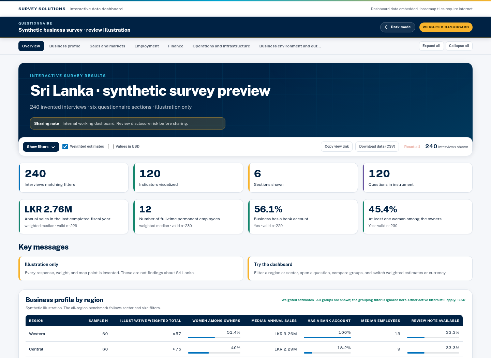

# SurvEye

**Interactive survey dashboards, directly from Stata.**

SurvEye turns your questionnaire and Stata data into a single HTML dashboard. It uses the questionnaire's labels and sections to organize charts and statistics automatically—no chart or web code required.

Open the finished file in a browser. Your readers do not need Stata.



*Preview uses synthetic data, not real survey findings.*

## What you can do

- **Explore responses:** view charts, distributions, and summary statistics by questionnaire section.
- **Compare groups:** filter by variables such as region or sector, use survey weights, and export charts or filtered data.
- **Add maps:** show interview locations with country or district boundaries, including compatible boundary ZIP files.

## What you need

**Stata 16 or newer with Java enabled**, your survey dataset, and its questionnaire:

- **Survey Solutions:** questionnaire preview in HTML.
- **SurveyCTO:** form definition in XML (preferred), or a supported printable form in HTML.

No Python, R, or separate web server is needed.

## Install

Run this in Stata:

```stata
net install surveye, from("https://raw.githubusercontent.com/arehman10/SurvEye/main/") replace
```

Restart Stata after updating an existing installation. Regenerate old dashboards to apply updates.

## Create your first dashboard

Load your data and point SurvEye to the matching questionnaire:

```stata
use "survey_data.dta", clear

surveye using "questionnaire.html", ///
    saving("dashboard.html") open
```

Replace the filenames with your own. For SurveyCTO, use your XML or HTML questionnaire instead. SurvEye saves `dashboard.html` and opens it in your browser.

Add `replace` to overwrite an existing dashboard.

### Add a title and filters

For a dataset containing `region` and `sector`:

```stata
surveye using "questionnaire.html", ///
    saving("dashboard.html") ///
    title("Survey results") ///
    filters(region sector) ///
    replace open
```

Readers can then select a region or sector to update the results.

## Privacy and offline use

**The dashboard contains data, not just pictures.** SurvEye processes data locally and does not upload survey responses. However, the HTML embeds selected data and may include precise GPS coordinates. Store and share it with the same care as the source dataset.

Charts, survey points, and embedded boundaries work offline. Background map tiles require internet access.

## Help

For all options—including weights, maps, themes, and simulated-data previews—run:

```stata
help surveye
```

[Example commands](example.do) · [Release notes](CHANGELOG.md) · [Report a problem](https://github.com/arehman10/SurvEye/issues)

## Author and license

**Attique Ur Rehman** · Enterprise Analysis Unit, World Bank

Developed with AI assistance. Thanks to [Fahad Mirza](https://github.com/fahad-mirza) for guidance and inspiration from his Stata tools.

[MIT License](LICENSE). An independent utility; its outputs do not necessarily represent World Bank views. Not affiliated with or endorsed by SurveyCTO.
